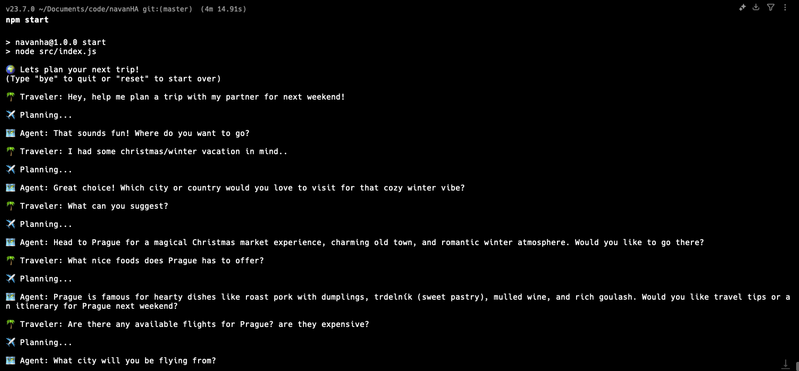
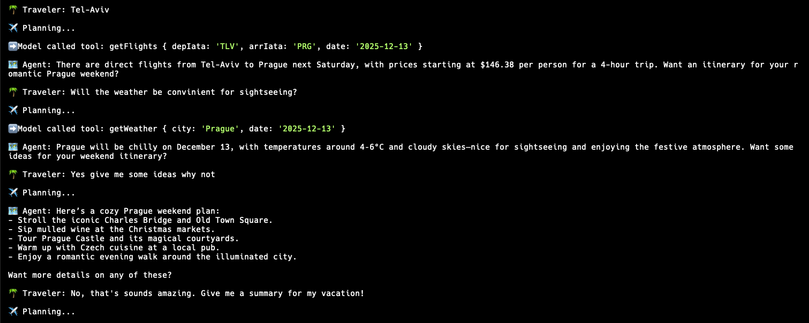
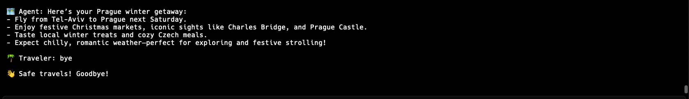

# Travel Trip Planner Agent

I have chosen to implement a Travel-Planner agent.

The agent can answer a wide variety of question from its general knowledge and accompanies it with live data from two integrated tools:

Flight tool and weather tool.

## Implementation details

### LLM
For LLM I chose gpt-4.1, which is both not too expensive and also scores high on benchmarks of conversation and general knowledge.
In addition - the JS SDK of OpenAi allows for built-in tool integration.

### Tools
I am using two free API's to pull live weather and flights data.

### Context
I have implemented an in-memory context mechanism that saves and enrich the context of the API call to the llm on each request.

### Guardrails
Added a loop-stopping mechanism to avoid long iterations and invested heavily in prompt engineering to allow for both safety and
friendly/helpful conversations.

### Prompt Engineering
Provided clear and safe explanation for context, added a hidden chain-of-thought instruction to improve results.


## Local Project Setup 

```bash
npm install
```

Create a `.env` file, and add the next lines:
```
OPENAI_API_KEY=your_key
AMADEUS_API_KEY=your_key
AMADEUS_API_SECRET=your_secret
```

I have supplied keys for all three in the e-mail.

Run:
```bash
npm start
```


## Example Conversation

```
🌴 Traveler: Hey, help me plan a trip with my partner for next weekend!

✈️  Planning...

🗺️  Agent: That sounds fun! Where do you want to go? 

🌴 Traveler: I had some christmas/winter vacation in mind..

✈️  Planning...

🗺️  Agent: Great choice! Which city or country would you love to visit for that cozy winter vibe? 

🌴 Traveler: What can you suggest?

✈️  Planning...

🗺️  Agent: Head to Prague for a magical Christmas market experience,
 charming old town, and romantic winter atmosphere.
  Would you like to go there? 

🌴 Traveler: What nice foods does Prague has to offer?

✈️  Planning...

🗺️  Agent: Prague is famous for hearty dishes like roast pork with dumplings,
 trdelník (sweet pastry), mulled wine, and rich goulash.
  Would you like travel tips or an itinerary for Prague next weekend? 

🌴 Traveler: Are there any available flights for Prague? are they expensive?

✈️  Planning...

🗺️  Agent: What city will you be flying from? 

🌴 Traveler: Tel-Aviv

✈️  Planning...

➡️ Model called tool: getFlights { depIata: 'TLV', arrIata: 'PRG', date: '2025-12-13' } 

🗺️  Agent: There are direct flights from Tel-Aviv to Prague next Saturday,
 with prices starting at $146.38 per person for a 4-hour trip.
  Want an itinerary for your romantic Prague weekend? 

🌴 Traveler: Will the weather be convinient for sightseeing?

✈️  Planning...

➡️ Model called tool: getWeather { city: 'Prague', date: '2025-12-13' } 

🗺️  Agent: Prague will be chilly on December 13,
 with temperatures around 4–6°C and cloudy skies—nice for sightseeing and enjoying the festive atmosphere.
 Want some ideas for your weekend itinerary? 

🌴 Traveler: Yes give me some ideas why not

✈️  Planning...

🗺️  Agent: Here’s a cozy Prague weekend plan:
- Stroll the iconic Charles Bridge and Old Town Square.
- Sip mulled wine at the Christmas markets.
- Tour Prague Castle and its magical courtyards.
- Warm up with Czech cuisine at a local pub.
- Enjoy a romantic evening walk around the illuminated city. 

Want more details on any of these? 

🌴 Traveler: No, that's sounds amazing. Give me a summary for my vacation!

✈️  Planning...

🗺️  Agent: Here’s your Prague winter getaway:
- Fly from Tel-Aviv to Prague next Saturday.
- Enjoy festive Christmas markets, iconic sights like Charles Bridge, and Prague Castle.
- Taste local winter treats and cozy Czech meals.
- Expect chilly, romantic weather—perfect for exploring and festive strolling! 

🌴 Traveler: bye

👋 Safe travels! Goodbye!
```

---

## Agent Demo






